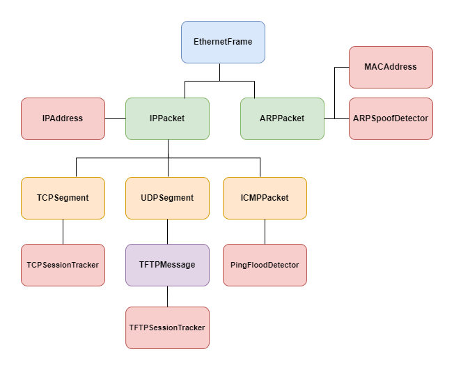

# IDS_sniffer

`IDS_sniffer` is a Linux network packets sniffer written in C language based on libpcap. 

## Goals

`IDS_sniffer` is for learning and research purposes like in cybersecurity or in network defense. 

## Features
<p align="center">

</p>

- Integrate with `libpcap` to support: filtering captured packets, capturing packets offline, capturing packets on specific devices and capturing packets in promiscuous mode.
- Analyze network packets at low layers of the TCP/IP stack, including `Ethernet`, `ARP`, `ICMP`, `IP(IPv4)`, `TCP`, `UDP`, etc. Also one protocol in the application layer: `TFTP`. 
- Detect network security attacks:
    - ARP spoofing detection
    - Ping flood detection
- Analyze and track network traffics:
    - TCP session tracking and traffic analysis
    - TFTP session tracking and traffic analysis
- Develop a generic Map data structure based on HashTable to support varoius workflow


## Building

A clean `Makefile` is provided in this project, to build just run:

`make`

## Usage

```sh
Usage: sniffer [-d XXX -h]
-d XXX: device to capture from, where XXX is device name (ex: eth0).
-f 'filter' : filter captures according to BPF expression (ex: 'ip or arp').
-h : show this information.
-i file: read datagram from given file instead of a device.
-l file: log captured datagrams in given file.
-n : number of datagrams to capture.
-p : active promiscuous capture mode.
-q : active quite mode.
-r : active raw display of captured data.
-s: apply specified security application. Available applications: arpspoof, pingflood, tcptrack, tftptrack.
-S: #.#.#.# : IP address of TFTP server to monitor.
```


## External dependencies
The source code called `cPacketSniffer` relies on `libpcap`, which is a famous library in the network capturing field. And the libraries are pretty straightforward to install.

## Acknowledgement
This project is based on the following open source [document](http://tcpip.marcolavoie.ca/index.html), which is owned by **Marco Lavoie**. Thanks for sharing this great document. 

The difference between my project and original project is that I developed it and made it an IDSytem. The original project is written in `C++`, which is great.. 

The application developed in this project is the same as the original one: the `network packet capture and injection` application on the Linux system. 


